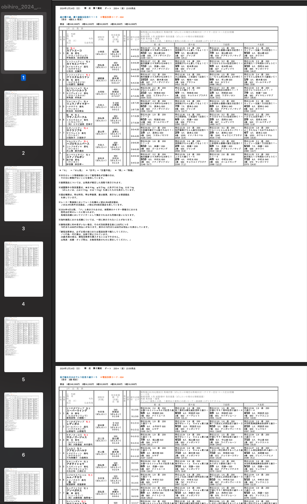

# 概要
keiba.go.jp の出走表を開催日ごとに全レースを1つのPDFファイルにまとめるだけです。
生成したPDFファイルをiPad等の携帯端末に入れると使いやすいかと思います。
自己責任で使用してください。

# 導入
docker-composeを使用します。

bilid からの up
```
$ docker-compose build
$ docker-compose up
```

コンテナに入る
```
$ docker compose exec -it app bash
```
必要なライブラリをインストール
```
$ bundle install
$ npm install
```

# 使い方
コンテナに入った状態でファイルを実行
```
$ ruby app.rb
```

馬場コード・年・月・日 を聞かれるので入力
```
{:obihiro=>3, :monbetsu=>36, :morioka=>10, :mizusawa=>11, :urawa=>18, :funabashi=>19, :ooi=>20, :kawasaki=>21, :kanazawa=>22, :kasamatsu=>23, :nagoya=>24, :sonoda=>27, :himeji=>28, :kochi=>31, :saga=>32}
リストから馬場コードを入力してください。
3
Enter the year. ex. 2020
2024
Enter the month. ex. 01
01
Enter the day. ex. 01
14
```
`completed!`が表示されたら完了です。
`pdf`ディレクトリの中にPDFが生成されます。

